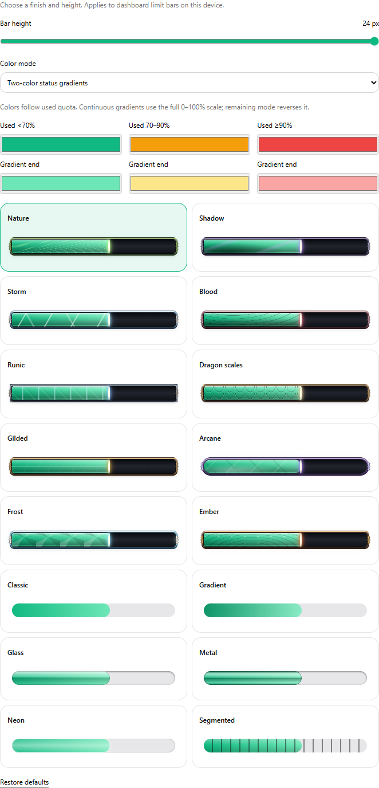

# Limit bar appearance

The Limits page palette button and Settings → Usage & Limits share the same appearance settings. Sixteen CSS/SVG finishes render without downloaded artwork or animation loops. Height is bounded to 6–24 px. The decorative frames reserve vertical space, ignore pointer events, and do not change quota widths or pace marker positions.

Classic remains the default finish, with a 12 px default height. Users can select 6 px to restore the previous compact height. The fantasy finishes take inspiration from game cast bars; their CSS textures and SVG decorations are original, with no game assets bundled.

## Colors

- Status colors retain the existing used-quota thresholds: below 70%, 70% to below 90%, and 90% or more.
- Status gradients have independent start/end colors for each of those three states.
- Continuous gradients use the three start colors over the full quota scale, with stops at 0%, 70%, and 90%. The visible fill samples that scale rather than compressing a complete rainbow into a nearly empty bar. Remaining mode reverses the scale.
- Color customization applies to quota bars. Subscription lifecycle and reset-credit bars retain their separate semantic colors.

Old two-field settings migrate automatically. Invalid hex colors, unknown styles, and invalid heights normalize to defaults. Multiple mounted consumers and browser tabs stay synchronized. Browser storage failures retain session behavior.

## Windows

The Windows WebView2 dashboard consumes the same built assets. Windows additionally saves the appearance JSON under `%LOCALAPPDATA%/TokenTracker/limit-bar-appearance.json` through the existing native settings bridge, restoring it when a loopback port changes. A late native snapshot cannot undo edits already made in that window.

For a local test build, build the dashboard with `TOKENTRACKER_BUILD_PET=1`, run `TokenTrackerWin/scripts/bundle-node.ps1`, publish the .NET project, and copy `EmbeddedServer` next to the published executable, as in the Windows release workflow. Building the .NET executable alone does not update its embedded dashboard. This feature branch does not publish a release.

Manual launches open the dashboard, including a second launch while the tray app is already running. Login startup remains quiet, and OAuth deep links keep their existing handling. Native macOS menu-bar and widget renderers are outside the scope of these dashboard appearance controls.
